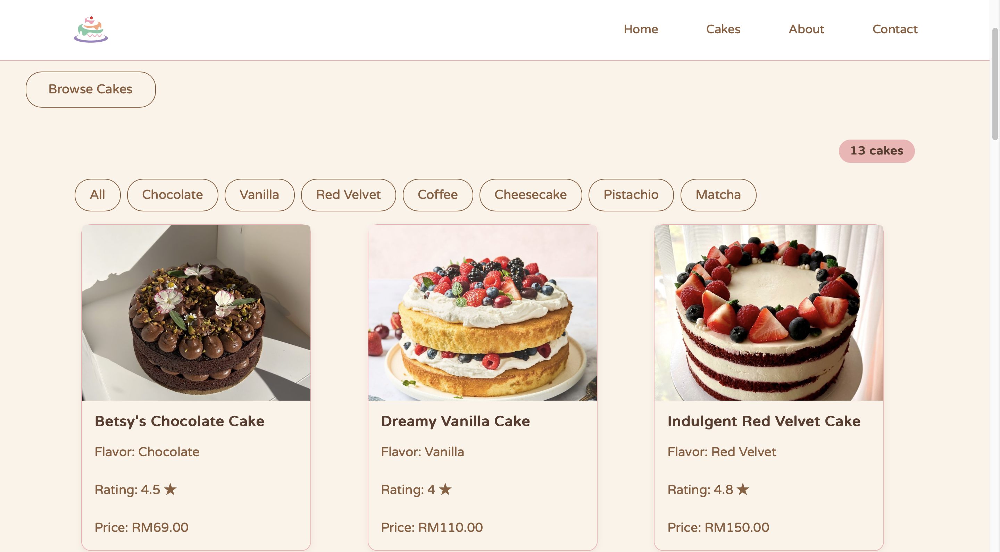

# Sweet Layers 🍰

_Handcrafted cakes, one layer at a time._

Sweet Layers is a browsable cake catalog for a home-bakery brand, built as a React learning project.

## Screenshot

## Features

- 🍰 **11 real cakes** — each with a name, photo, flavor, customer rating, and price
- 🏷️ **Flavor filtering** — narrow the collection down to Chocolate, Vanilla, Red Velvet, Coffee, Cheesecake, Pistachio, Matcha, or view All
- 🔢 **Live cake count** — updates instantly as filters or search change
- 📱 **Responsive grid layout** — cards reflow cleanly across different screen sizes
- 🧭 **Sticky navigation bar** — smooth-scrolls to Home, Cakes, About, and Contact sections

## Built with

- [React](https://react.dev/)
- [Vite](https://vitejs.dev/)
- [Bootstrap](https://getbootstrap.com/)
- Custom CSS

## Live demo

[View live demo] [Sweet Layers](https://sweet-layers-six.vercel.app)
